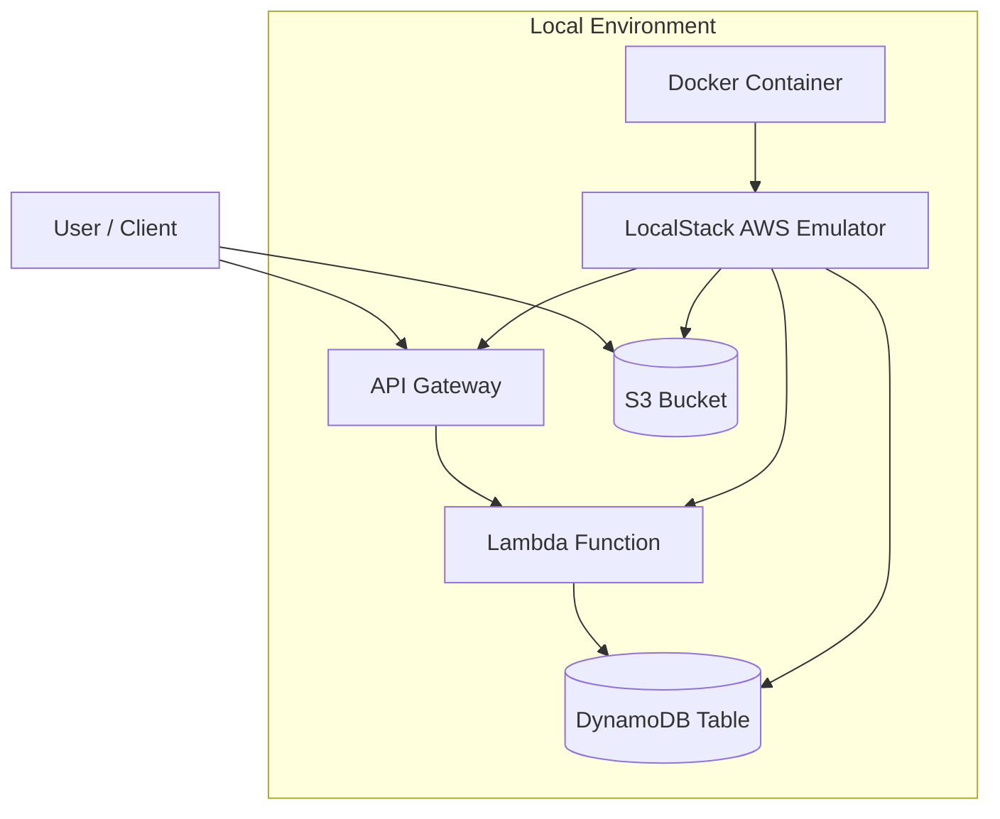
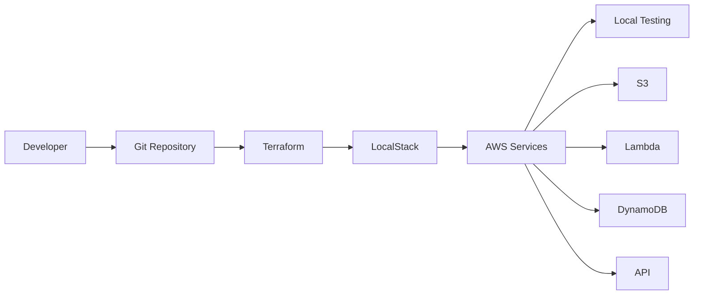

# Terraform + LocalStack AWS DevOps Lab

## Overview

This project demonstrates how to build and manage AWS infrastructure locally using **Terraform** and **LocalStack**. It simulates a cloud environment on a local machine, allowing developers and DevOps engineers to practice Infrastructure as Code (IaC) workflows without deploying resources to a real AWS account.

The project provisions a **serverless-style architecture** that includes:

* Amazon S3 (Object Storage)
* AWS Lambda (Serverless Compute)
* Amazon DynamoDB (NoSQL Database)
* Amazon API Gateway (REST API)

All resources are deployed locally using **Terraform** and executed via **LocalStack running inside Docker**.

This project is intended for **DevOps learning, experimentation, and portfolio demonstration**.

---

# Architecture

## System Architecture



This architecture simulates a **serverless AWS stack locally** using LocalStack.

---

# DevOps Workflow



This workflow demonstrates how **Infrastructure as Code integrates into a DevOps lifecycle**.

---

# Tech Stack

| Tool       | Purpose                    |
| ---------- | -------------------------- |
| Terraform  | Infrastructure as Code     |
| LocalStack | Local AWS cloud emulator   |
| Docker     | Container runtime          |
| AWS CLI    | Interact with AWS services |
| Python     | Lambda runtime             |
| Git        | Version control            |

---

# Project Structure

```
terraform-localstack-project
│
├── docker-compose.yml
│
├── terraform
│   ├── provider.tf
│   ├── s3.tf
│   ├── lambda.tf
│   ├── dynamodb.tf
│   └── apigateway.tf
│
├── lambda
│   └── handler.py
│
└── README.md
```

---

# Prerequisites

Before running this project, ensure the following tools are installed:

* Docker
* Terraform
* AWS CLI
* Python 3.x

Verify installation:

```
docker --version
terraform --version
aws --version
python --version
```

---

# Running LocalStack

Start the LocalStack container using Docker Compose.

```
docker compose up -d
```

Verify container is running:

```
docker ps
```

LocalStack services will be available at:

```
http://localhost:4566
```

---

# Configure AWS CLI for LocalStack

Configure AWS CLI with dummy credentials.

```
aws configure
```

Example configuration:

```
AWS Access Key ID: test
AWS Secret Access Key: test
Default region: us-east-1
Default output format: json
```
